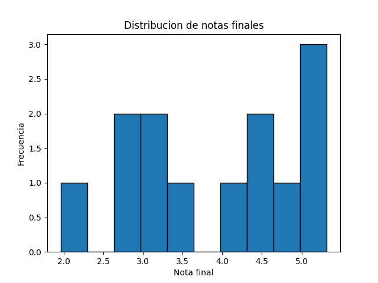

# Notas globales

| Usuario | P1 | P2 | P3 | Nota final |
|---|---:|---:|---:|---:|
| a.deferrariugarte | 0.96 | 1.38 | 0.90 | 5.3 |
| d.guerracorts | 1.35 | 0.78 | 0.60 | 4.6 |
| d.muozastete | 1.05 | 1.26 | 0.90 | 5.3 |
| d.quevedoancul | 0.54 | 0.57 | 0.57 | 3.2 |
| e.portillocarrasco | 1.02 | 0.42 | 0.00 | 2.9 |
| e.sezsez | 0.60 | 1.26 | 0.60 | 4.3 |
| g.lpezastorga | 0.93 | 0.54 | 0.30 | 3.4 |
| j.veravsquez | 1.41 | 0.45 | 0.84 | 4.6 |
| m.peagonzlez | 0.63 | 0.42 | 0.36 | 2.9 |
| r.jarasalgado | 0.18 | 0.36 | 0.18 | 2.0 |
| t.moyafernndez | 1.14 | 1.26 | 0.57 | 5.0 |
| v.rogelcarrasco | 1.26 | 1.32 | 0.60 | 5.2 |
| v.veraaranda | 1.00 | 0.39 | 0.18 | 3.1 |
## Estadisticas globales

| Problema | Promedio | Maximo | Minimo |
|---|---:|---:|---:|
| P1 | 0.93 | 1.41 | 0.18 |
| P2 | 0.80 | 1.38 | 0.36 |
| P3 | 0.51 | 0.90 | 0.00 |

**Promedio nota final:** 4.0

